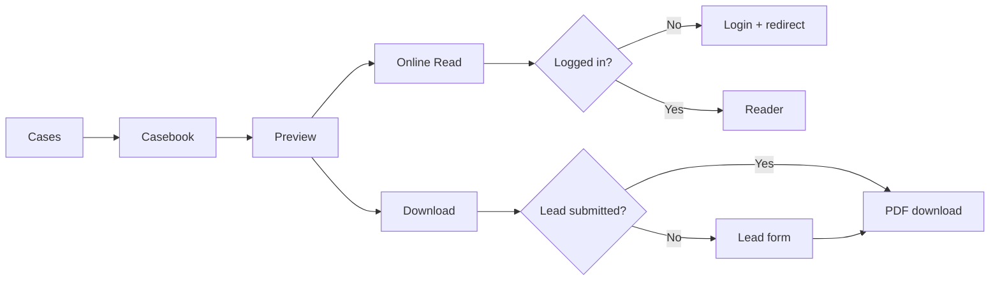

# OpenCSG 客户案例总册闭环网站 Demo

用于产品、设计与研发共同体验“案例中心 → 案例总册 → 公开预览 → 登录阅读 / 留资下载”的完整产品闭环。项目不会修改 `opencsg.com`，所有状态均为本地模拟。

## 在线 Demo

GitHub Pages URL：发布后更新。

由于 GitHub Pages 为纯静态托管，项目使用 `HashRouter`，例如：`/#/cases/casebook/`。这保证用户刷新任意业务页面时不会出现 404。

## 页面结构

| 产品路径 | Hash URL | 说明 |
| --- | --- | --- |
| `/cases/` | `#/cases/` | 客户案例中心及高权重总册入口 |
| `/cases/casebook/` | `#/cases/casebook/` | 案例总册 Landing Page |
| `/cases/casebook/read/` | `#/cases/casebook/read/` | 登录后完整在线阅读器 |
| `/cases/casebook/download/` | `#/cases/casebook/download/` | 下载留资页 |
| `/login/` | `#/login/?redirect=...` | Demo 登录及 redirect 回跳 |

## 用户流程



## 登录与下载逻辑

- 在线阅读只检查登录状态；未登录用户进入登录页，Demo 登录后自动回跳阅读器。
- 下载只检查留资状态；登录不会自动获得下载权限。
- 表单成功后显示成功提示并自动下载，自动下载失败时可手动触发。
- 已留资用户再次下载时不重复填写。
- 阅读器内的下载按钮使用同一套留资判断。

## localStorage Demo Key

| Key | 含义 |
| --- | --- |
| `opencsg_demo_logged_in` | Demo 登录状态 |
| `opencsg_casebook_lead_submitted` | Demo 留资状态 |

右下角 `Demo Controls` 可分别重置两种状态，用于验收四种状态组合。

## 本地运行

```bash
npm install
npm run dev
```

生产构建：

```bash
npm run build
```

## 正式研发需要替换的接口

- AUTH API：真实 Session / Token、登录与 redirect 白名单。
- USER API：用户与组织资料，支持安全预填。
- LEAD API：CRM / Lead 写入、幂等判断与下载授权。
- PDF ACCESS API：在线阅读鉴权与短时页面资源。
- DOWNLOAD API：留资校验、短时下载 URL、下载记录。

更详细的权限、异常与资源接入说明见：

- [`docs/product-flow.md`](docs/product-flow.md)
- [`docs/production-integration.md`](docs/production-integration.md)
- [`docs/manual-github-upload.md`](docs/manual-github-upload.md)

## Demo 内容与正式需求

Demo 已实现：页面、交互、响应式、登录回跳、留资校验、重复下载判断、基于 PDF.js 的 106 页自定义阅读器、正式 PDF 下载、调试控制、静态部署配置。

正式上线必须补充：真实 CMS 数据、账号系统、CRM、服务端权限、审计日志、隐私合规文本与埋点，并确认当前 106 页 PDF 为最终审核版本。

## 素材替换清单

- `public/assets/casebook/OpenCSG-Customer-Casebook.pdf`：用户提供的 106 页客户案例总册原文件。
- `public/assets/casebook-preview/01-cover.webp` 至 `08-results.webp`：从正式 PDF 前 8 页生成的公开预览素材。
- `src/data/content.js`：精选案例摘要和相关推荐待 CMS / 业务审核内容替换。
