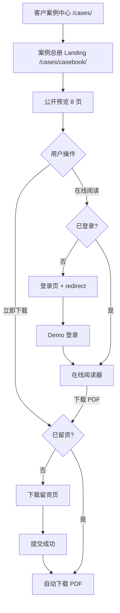

# 客户案例总册业务流程

## 1. 核心链路

## 2. 权限判断

登录状态与下载状态严格分离：

| 场景 | 在线阅读 | PDF 下载 |
| --- | --- | --- |
| 未登录 + 未留资 | 先登录，再回跳阅读器 | 先留资，再下载 |
| 已登录 + 未留资 | 直接进入阅读器 | 先留资，再下载 |
| 未登录 + 已留资 | 先登录，再回跳阅读器 | 直接下载 |
| 已登录 + 已留资 | 直接进入阅读器 | 直接下载 |

Demo 中的登录状态键为 `opencsg_demo_logged_in`，留资状态键为 `opencsg_casebook_lead_submitted`。

## 3. redirect 行为

未登录用户点击“在线阅读”后进入：

`#/login/?redirect=/cases/casebook/read/`

Demo 登录写入登录状态后读取 `redirect`，使用 replace 导航回阅读器，避免返回键再次进入登录页。

## 4. 下载与重复下载

1. 所有“立即下载”与阅读器“下载 PDF”按钮都调用同一判断逻辑。
2. 未留资时进入留资页；表单校验成功后只在本地写入状态。
3. 成功页先提示“正在下载”，随后触发 PDF 下载。
4. 若浏览器拦截自动下载，用户可点击“下载未开始？手动下载”。
5. 已留资用户再次点击下载时不再显示表单。

## 5. 异常处理建议

- 登录失败：保留 redirect，展示错误并允许重试。
- Lead API 失败：不写入下载权限，保留表单内容并显示可恢复错误。
- 自动下载失败：展示手动下载按钮，并记录失败原因用于监控。
- PDF 鉴权失败：刷新短期访问凭证；仍失败则引导用户重新登录或联系支持。
- PDF 资源不可用：返回明确的资源状态，不暴露对象存储原始地址。
